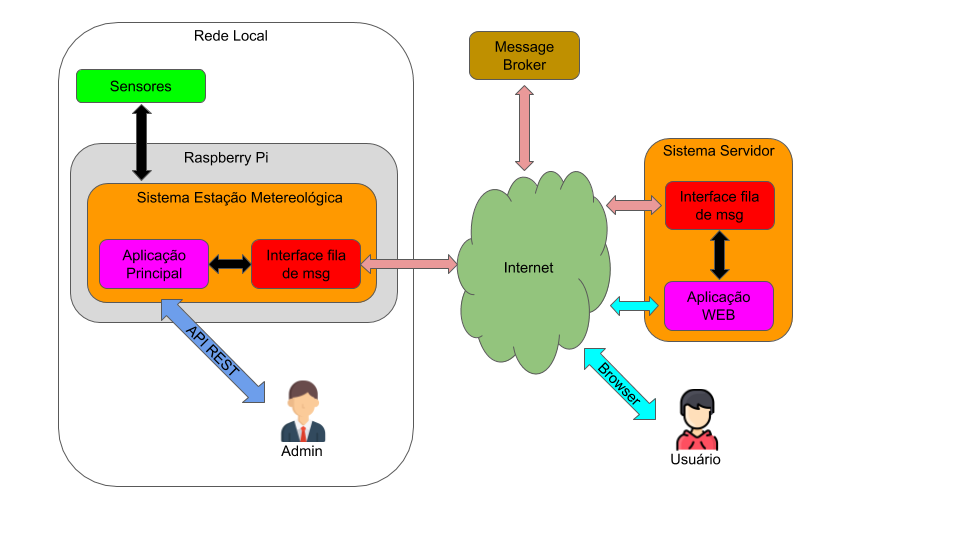

### Diagrama geral do Projeto

## Organização do Repositório

- **Documentação:**
  - [Modelagem - diagramas](./doc/README.md)

- **Sistema Estação:**
  - [Código Fonte]()

- **Sistema Servidor:**
  - [Código Fonte]()